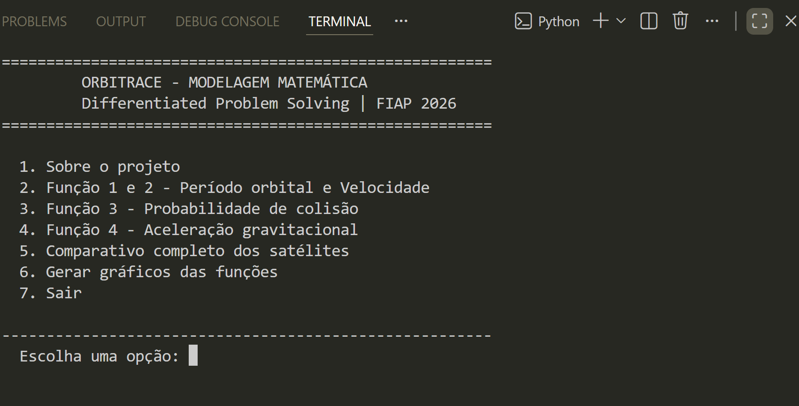
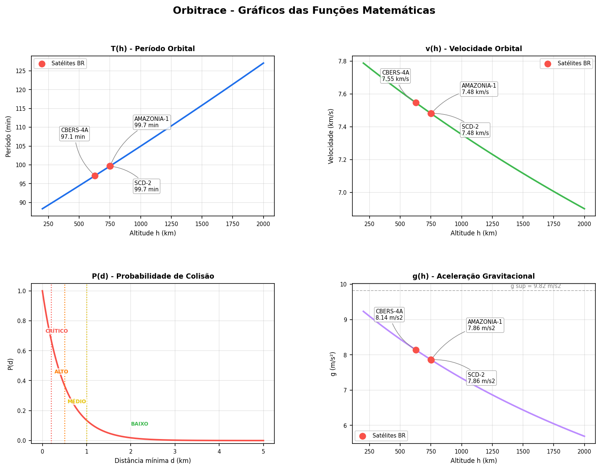

# Orbitrace - Modelagem Matemática Orbital

Projeto acadêmico desenvolvido para a **Global Solution 2026 - 1º semestre** da FIAP, na disciplina **Differentiated Problem Solving**. O Orbitrace modela, calcula e visualiza funções matemáticas aplicadas ao monitoramento de satélites brasileiros em órbita terrestre baixa, com foco em risco de colisão com detritos espaciais.

## Visão Geral

O sistema simula uma ferramenta de apoio à análise orbital para satélites brasileiros, como **CBERS-4A**, **Amazônia-1** e **SCD-2**. A proposta é demonstrar como modelos matemáticos podem apoiar decisões relacionadas à segurança de missões espaciais e à preservação de infraestrutura crítica.

O projeto está alinhado ao **ODS 9 - Indústria, Inovação e Infraestrutura**, explorando uma alternativa acessível, educacional e open source para compreensão de riscos orbitais.

## Funcionalidades

- Cálculo do período orbital pela 3ª Lei de Kepler.
- Cálculo da velocidade orbital circular.
- Estimativa pedagógica da probabilidade de colisão por modelo exponencial.
- Cálculo da aceleração gravitacional em diferentes altitudes.
- Comparativo dos satélites brasileiros monitorados.
- Geração automática de gráficos com `matplotlib`.
- Interface interativa via terminal.

## Modelos Matemáticos

| Função | Fórmula | Interpretação |
| --- | --- | --- |
| Período orbital | `T(h) = 2π * sqrt((R_T + h)^3 / μ)` | Quanto tempo o satélite leva para completar uma órbita. |
| Velocidade orbital | `v(h) = sqrt(μ / (R_T + h))` | Velocidade necessária para manter órbita circular. |
| Probabilidade de colisão | `P(d) = e^(-d / λ)` | Estimativa de risco conforme a distância mínima entre objetos. |
| Aceleração gravitacional | `g(h) = μ / (R_T + h)^2` | Intensidade da gravidade na altitude analisada. |

Constantes utilizadas:

- `μ = 398600.4418 km³/s²`
- `R_T = 6371.0 km`
- `λ = 0.5 km`

## Demonstração no Terminal

<p align="center">
  
</p>

## Gráficos Gerados

O sistema gera automaticamente uma visualização com quatro subplots: período orbital, velocidade orbital, probabilidade de colisão e aceleração gravitacional.

<p align="center">
  
</p>

## Estrutura do Projeto

```text
.
├── assets/
│   └── .gitkeep
├── ORBITRACE-CALCULO-GS.py
├── ORBITRACE-DOCUMENTACAO-CALCULO.pdf
├── terminal.png
├── orbitrace_graficos.png
├── .gitignore
├── requirements.txt
└── README.md
```

## Documentação

A documentação acadêmica completa está disponível em:

```text
ORBITRACE-DOCUMENTACAO-CALCULO.pdf
```

## Tecnologias

- Python
- NumPy
- Matplotlib
- Modelagem matemática aplicada

## Observação

O modelo de probabilidade de colisão usado no projeto tem finalidade educacional. Sistemas reais de monitoramento orbital utilizam modelos mais complexos, com incertezas orbitais, propagadores como SGP4 e dados atualizados de TLE.
